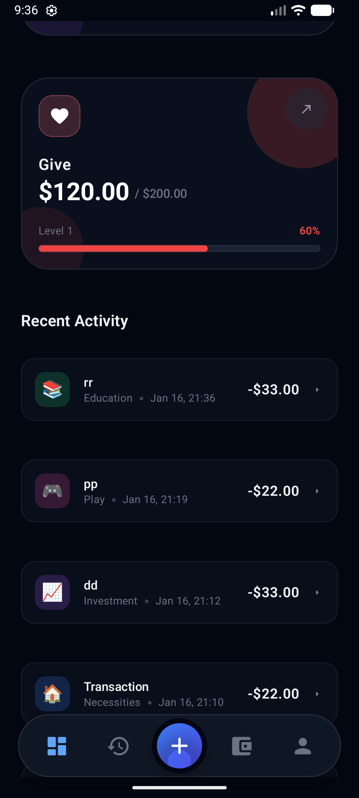

# Objective
Implement "Validate Fields & Save Transaction Logic" for Android.

# Description
This PR implements Room Database for local persistence, validation logic for the "Add Transaction" screen, and integration of real data into the Dashboard.

## Changes
- **Room Database**: Added `AppDatabase`, `Transaction` entity, and `TransactionDao`.
- **Validation**: Added `TransactionValidator` and Unit Tests.
- **ViewModel**: Added `MainViewModel` to manage state and DB operations.
- **UI**:
    - Updated `AddTransactionScreen` with validation (amount, jar selection).
    - Updated `DashboardScreen` to display real transactions and empty state.
    - Updated `TransactionHistoryScreen` to use real data.

## Linked Issue
Resolves oatrice/JarWise-Root#18

## Screenshots
| Dashboard |
|:---:|
|  |

## Verification
- [x] Unit Tests passed (`./gradlew testDebugUnitTest`)
- [x] Build successful (`./gradlew :app:assembleDebug`)
- [x] Manual verification on Emulator
